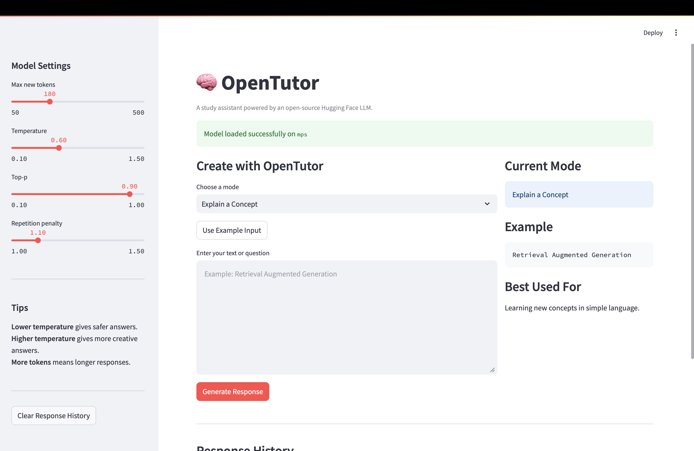
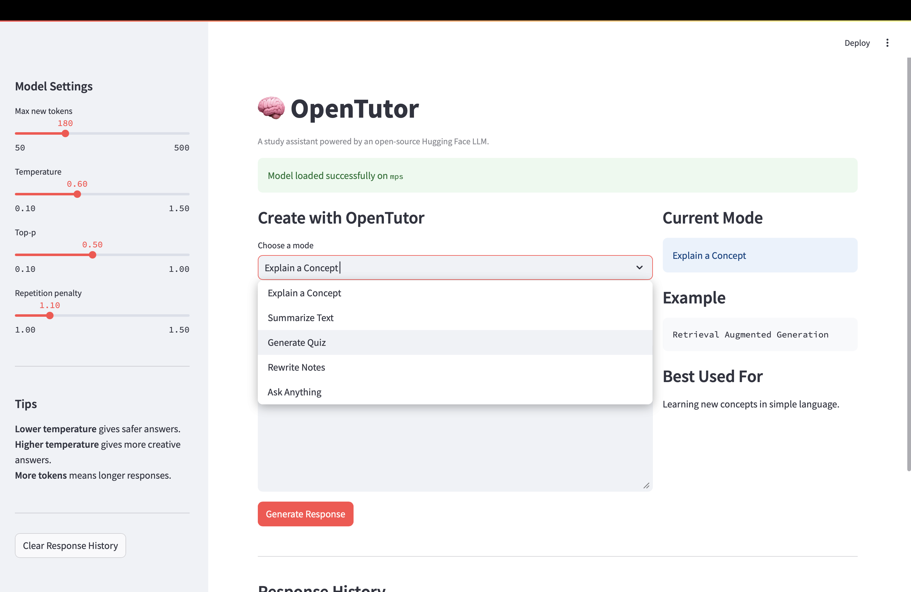
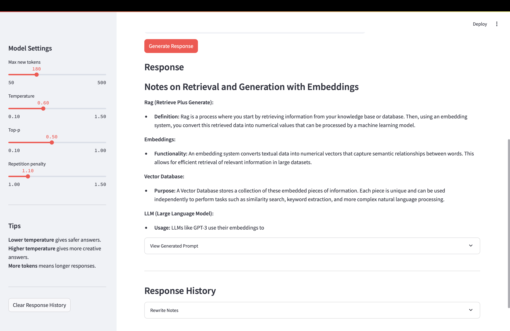
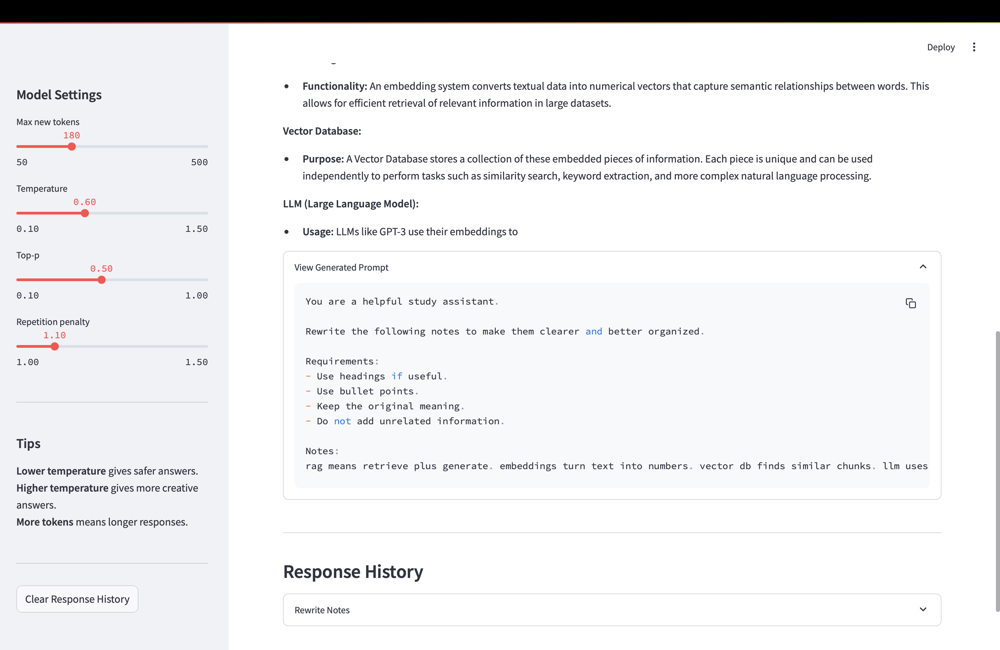

## Live Demo

[Try OpenTutor here](https://uday4-open-tutor.hf.space)

# OpenTutor — Open-Source LLM Study Assistant

OpenTutor is a study assistant powered by an open-source Hugging Face language model. It helps users explain concepts, summarize text, generate quiz questions, rewrite notes, and answer general questions through a Streamlit web interface.

Unlike API-based LLM apps, OpenTutor runs an open-source model locally using Hugging Face Transformers.

## Features

* Run an open-source Hugging Face LLM locally
* Explain concepts in beginner-friendly language
* Summarize long text into key points
* Generate quiz questions from study material
* Rewrite messy notes into organized notes
* Ask general questions
* Adjust generation settings such as temperature, top-p, max tokens, and repetition penalty
* View generated prompt for debugging
* Store response history during the session
* Streamlit-based web interface

## Demo Screenshots

### Home



### Explain Mode



### Quiz Mode



### Response History



## Architecture

```text
User Input
    ↓
Mode Selection
    ↓
Prompt Template
    ↓
Generation Settings
    ↓
Hugging Face Tokenizer
    ↓
Open-Source LLM
    ↓
Clean Generated Response
    ↓
Streamlit UI
```

## Tech Stack

* Python
* Streamlit
* Hugging Face Transformers
* PyTorch
* Accelerate

## Model

The project uses:

```text
Qwen/Qwen2.5-0.5B-Instruct
```

This is a lightweight instruction-tuned open-source model suitable for local experimentation.

## Project Structure

```text
open-tutor/
│
├── app/
│   ├── __init__.py
│   ├── config.py
│   ├── generator.py
│   ├── main.py
│   ├── model_loader.py
│   ├── prompts.py
│   └── streamlit_app.py
│
├── screenshots/
│   ├── home.png
│   ├── explain-mode.png
│   ├── quiz-mode.png
│   └── history.png
│
├── .gitignore
├── README.md
└── requirements.txt
```

## Setup Instructions

### 1. Clone the repository

```bash
git clone  https://github.com/UdayKiranJadi/open-tutor.git
cd open-tutor
```

### 2. Create a virtual environment

```bash
python -m venv venv
```

Activate it:

```bash
source venv/bin/activate
```

On Windows:

```bash
venv\Scripts\activate
```

### 3. Install dependencies

```bash
pip install -r requirements.txt
```

### 4. Run the Streamlit app

```bash
streamlit run app/streamlit_app.py
```

The model may take some time to download during the first run.

## Usage

Choose one of the available modes:

```text
Explain a Concept
Summarize Text
Generate Quiz
Rewrite Notes
Ask Anything
```

Then enter your text or question, adjust generation settings if needed, and generate a response.

## Example Prompts

### Explain a Concept

```text
Retrieval Augmented Generation
```

### Summarize Text

```text
RAG is a technique where an AI system retrieves relevant information from an external knowledge base before generating an answer. This helps reduce hallucinations and improves factual accuracy.
```

### Generate Quiz

```text
Embeddings are numerical representations of text. Vector databases store embeddings and allow semantic similarity search.
```

### Rewrite Notes

```text
rag means retrieve plus generate. embeddings turn text into numbers. vector db finds similar chunks.
```

## Key Engineering Concepts

* Open-source LLM inference
* Hugging Face model loading
* Tokenization
* Prompt engineering
* Generation settings
* Temperature and top-p sampling
* Streamlit app development
* Local model execution
* Modular Python architecture

## Future Improvements

* Add support for larger models
* Add GPU optimization
* Add chat-style conversation memory
* Add document upload support
* Add RAG with local embeddings
* Add model selection from the UI
* Deploy on Hugging Face Spaces
* Add evaluation examples

## Author


